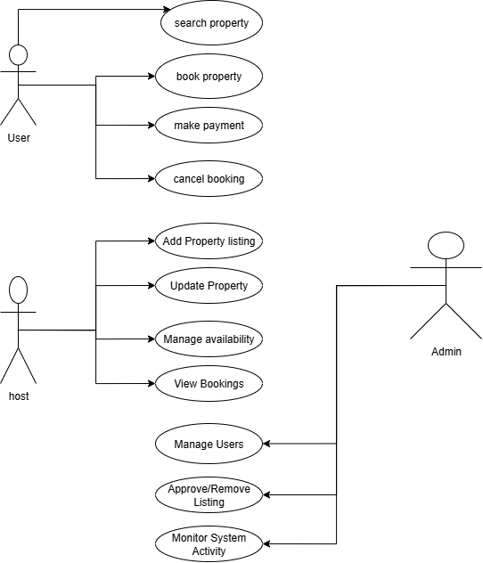

# Requirement Analysis in Software Development

## Introduction
This repository is dedicated to understanding and documenting the process of **requirement analysis** in software development.  

Requirement analysis is one of the most important phases in the software development life cycle (SDLC). Its purpose is to gather, analyze, and clearly define the needs of users and stakeholders before the actual design and coding begin.  

The materials in this repo will help explain:
- Why requirement analysis is critical for building successful projects.  
- Different types of requirements (functional, non-functional, business).  
- Methods and tools used to capture and validate requirements.  

This project serves as a resource for learning, practice, and reference in both academic and real-world development contexts.

## What is Requirement Analysis?

Requirement Analysis is the process of identifying, gathering, and defining the needs and expectations of users, stakeholders, and the system itself before building a software product. It ensures that everyone involved in the project has a clear understanding of what the system should do and how it should perform.  

In simple terms, it answers the question: **“What problem are we solving, and what exactly should the software do to solve it?”**

### Why It’s Important in SDLC
Requirement analysis is a critical phase in the **Software Development Life Cycle (SDLC)** because:
- It provides a **clear foundation** for design and development.  
- It helps avoid misunderstandings and costly rework later in the project.  
- It aligns developers, stakeholders, and users on the same vision.  
- It ensures both **functional requirements** (what the system should do) and **non-functional requirements** (performance, security, usability, etc.) are well defined.  
- It improves project success rates by reducing risks and ambiguities.  

Without proper requirement analysis, software projects often suffer from **scope creep, delays, and user dissatisfaction.** By investing time in this phase, teams save effort in the long run and deliver products that truly meet user needs.

## Why is Requirement Analysis Important?

Requirement Analysis is often considered the foundation of any successful software project. Skipping or rushing this step usually leads to confusion, wasted effort, and unhappy stakeholders. Below are some key reasons why it is so critical in the Software Development Life Cycle (SDLC):

1. **Prevents Miscommunication**  
   Requirement analysis creates a shared understanding between developers, stakeholders, and users. By clearly documenting expectations, it reduces misunderstandings and ensures everyone is working toward the same goal.  

2. **Saves Time and Cost**  
   Identifying requirements early helps detect potential issues before development begins. Fixing mistakes during the planning stage is much cheaper and faster than reworking code later in the project.  

3. **Defines Project Scope Clearly**  
   Well-analyzed requirements prevent scope creep (unplanned changes or features being added). With a clear scope, the team can stay focused, deliver on time, and meet deadlines effectively.  

4. **Improves Quality of the Final Product**  
   When requirements are properly gathered and validated, the final software is more likely to match user needs, perform reliably, and provide a better overall user experience.  

## Key Activities in Requirement Analysis

Requirement Analysis is not just a single step—it involves a series of activities that ensure the requirements are captured, understood, and validated properly. The five key activities are:

- **Requirement Gathering**  
  Collecting initial information from stakeholders, users, and other sources. This includes interviews, surveys, observations, and studying existing systems to understand the problem space.  

- **Requirement Elicitation**  
  Digging deeper into the gathered information to clarify expectations and uncover hidden needs. Techniques like workshops, brainstorming sessions, and use-case discussions are often used here.  

- **Requirement Documentation**  
  Recording requirements in a structured format, such as Software Requirement Specification (SRS) documents, user stories, or diagrams. Clear documentation ensures that nothing is missed and the team has a reference point.  

- **Requirement Analysis and Modeling**  
  Examining requirements to check for conflicts, feasibility, and consistency. Modeling techniques (like flowcharts, UML diagrams, or prototypes) help visualize the system and identify potential issues early.  

- **Requirement Validation**  
  Verifying that the documented requirements truly represent the needs of the users and stakeholders. This step often involves reviews, walkthroughs, and feedback sessions to confirm accuracy before moving into design and development.  

## Types of Requirements

When building the Airbnb clone, it’s important to differentiate between **what the system does** (functional requirements) and **how well it performs and operates** (non-functional requirements).

### Functional Requirements  
These define the actions or features the system must provide — essentially, what it should do. For instance:

- **User authentication**: Users should be able to sign up, log in, and log out of their accounts.  
- **Property search and filtering**: Users can search listings by location, price, and amenities, and see accurate, filtered results.  
- **Booking management**: Users can select available dates, make a booking, and receive a confirmation.  
- **Payment processing**: The system must handle checkout, process payments, and update booking status.

These are core behaviors the app must support—without them, the system simply wouldn’t function.

### Non-functional Requirements  
These specify how the system performs or behaves — quality attributes that reassure a smooth user experience. Examples include:

- **Performance**: Pages must load in under 3 seconds, even during peak usage.  
- **Reliability / Availability**: The booking system should aim for 99.9% uptime to minimize disruptions for users.  
- **Scalability**: The platform must handle a surge of users—especially during peak booking periods—without slowing down.  
- **Usability**: The interface should be intuitive and accessible, enabling users to complete bookings with ease.

These requirements define how well the system performs its functions in real-world conditions.

---

### Quick Summary: Functional vs Non-functional

| Type                      | Focus                                   | Airbnb Clone Example                                           |
|---------------------------|------------------------------------------|----------------------------------------------------------------|
| **Functional Requirements**     | What the system must do                 | Login, search properties, book a stay, process payments        |
| **Non-Functional Requirements** | How the system should perform or behave | Fast loading, high uptime, scalable under load, user-friendly UI |

---

By clearly distinguishing these two requirement types, your team gets a clear blueprint of both *what* to build and *how well* it must work. This clarity leads to better planning, design, and ultimately, a more reliable and user-friendly application.

## Use Case Diagrams

**Use Case Diagrams** are a type of visual representation used in software engineering to capture the interactions between users (actors) and a system. They illustrate what the system should do from the user’s perspective, rather than how it is implemented.

In a Use Case Diagram:
- **Actors** represent the users or external systems that interact with the application (e.g., Guest, Host, Admin).
- **Use Cases** represent the goals or functions the actors want to achieve (e.g., Book Property, Manage Listing, Make Payment).
- **System Boundary** defines the scope of the system being modeled.

### Benefits of Use Case Diagrams
- **Clarity of Requirements**: They make it easier to understand what features the system should provide and how users interact with it.  
- **Improved Communication**: Serve as a common language between stakeholders, designers, and developers.  
- **Scope Definition**: Clearly shows the boundaries of the system and what lies outside it.  
- **Prioritization**: Helps in identifying which use cases are most critical for users and should be implemented first.  
- **Validation**: Ensures that all user needs are captured and accounted for during the design process.  

## Use Case Diagram

The following diagram shows the interactions between actors (users, hosts, admin, and external systems) and the booking system:

